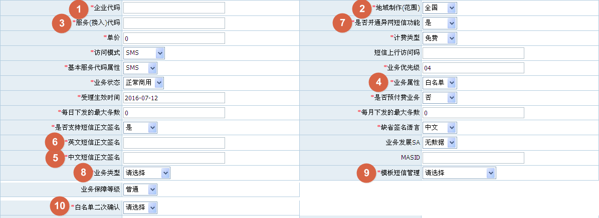
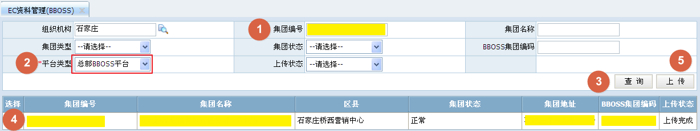

# 全国MAS开户操作流程  
> 基础要求：熟练掌握集团产品开户流程。  
> 全国MAS开户分为两步：1、省内产品开户，2、全国产品开户。请按照顺序操作。  
> 省内产品开户正常选择资费，全国产品开户不要选择任何资费，如果异网资费必选随便选择一档。  
> 开户后会产生两个订单（全国、省内），先完成全国订单，再完成省内订单。  
> 全国订单大概流程：省专线集客部审批（杨程）->发送服务开通->等待BBOSS反馈（总部）->资料归档。  
> 工单到达等待BBOSS反馈后客户经理注意观察手机接收10086下发的短信，成功后会下发短信。  
> 省内订单大概流程：参考[省内MAS订单处理](省内MAS订单处理.md)，少了第2和第3环节。    

## 1. 第一步：省内产品开户

### 1.1. 打开集团产品开户菜单  
菜单路径是：集团业务 ---> 开销户 ---> 集团产品开户。  

### 1.2. 在身份认证界面输入集团编号  
输入集团编号，点击查询。  

### 1.3. 设置付费帐号  
付费帐号有两种设置方式：  
1. 从该集团客户的现有付费账号中选择一个，新开户的产品产生的费用将计入被选择的付费账号。  
2. 勾选产生新账号，如无与原有产品合并付费的特殊需求，一般情况下应选择“产生新账号”。  

### 1.4. 选择主体产品
产品所在目录：集团短彩信类-企信通-MAS-移动CRM产品。  

### 1.5. 填写产品属性  
一般情况下，需要填写的属性为10项，其它属性没有必要修改：  
  

1. 企业代码：  
在BOSS系统中选择即可，一般情况下选择以4开头的企业代码，5开头的企业代码用于子端口开户。  

2. 地域制作(范围)：  
开通全国MAS时选择全国。  

3. 服务(接入)代码：  
在BOSS系统中选择即可，一般情况下选择1065750911XX长度为12位的服务代码。 全国MAS开户可用的服务代码主要以下几类：  
  * 移动公司分配的全网服务代码：1065750911XX  
  开通全国MAS时使用。  
  * 客户自携号服务代码：1XXXX、9XXXX、1069XXXX……。  
  客户自携号需提供相关备案文件，邮件上报市公司申请维护到BOSS系统中方可使用。  

4. 业务属性：  
  * 黑名单：默认可以向所有客户发送短信，不需要接收短信的客户添加到黑名单中可屏蔽。
  * 白名单：默认不可以向任何客户发送短信，需要接收短信的客户应添加到白名单中。  

5. 中文短信正文签名：  
应与集团名称一致。  

6. 英文短信正文签名：  
应与集团名称一致，可为应为名称或拼音。  

7. 是否开通异网短信功能：  
  * 是：需要开通异网功能选择是  
  * 否：不需要开通异网功能选择否  

8. 业务类型  
  * 内部管理类  
  * 外部服务类  
  * 营销推广类  
  * 公益类  
  如有不明请参考集2016年16号业务通知。  

9. 模板短信管理
  * 省内自建平台
  * 云MAS平台
  * 未采用木板短信管理  
  如何选择请参考签报审批和实际使用情况。  
  如有不明请参考集2016年16号业务通知。  

10. 白名单二次确认
  * 是  
  * 否
  如何选择请参考签报审批和实际使用情况。    
  如有不明请参考集2016年16号业务通知。  

### 1.6. 选择“增值产品”  
网内短信资费如下：  
* MAS-省移动CRM一（300元包5000条,超出0.05元/条）
* MAS-省移动CRM二（500元包10000条,超出0.05元/条）  

异网短信资费如下：
* MAS异网短信资费(0.06元/条)  
* MAS异网短信资费(0.08元/条)  
* MAS异网短信资费(0.10元/条)  

## 2. 第二步：全国产品开户

### 2.1. 上传集团到BBOSS  
菜单路径是：客户管理 ---> 集团客户管理 ---> 集团客户资料管理 ---> EC资料管理(BBOSS)。  
平台类型选择：总部BBOSS平台  
操作流程如下图：  
  

### 2.2. 打开集团产品开户菜单  
菜单路径是：集团业务 ---> 开销户 ---> 集团产品开户。  

### 2.3. 在身份认证界面输入集团编号  
输入集团编号，点击查询。  

### 2.4. 设置付费帐号  
付费帐号有两种设置方式：  
1. 从该集团客户的现有付费账号中选择一个，新开户的产品产生的费用将计入被选择的付费账号。  
2. 勾选产生新账号，如无与原有产品合并付费的特殊需求，一般情况下应选择“产生新账号”。  

### 2.5. 选择主体产品
产品所在目录：行业应用产品-解决方案包-全网MAS-全网MAS业务准入商品。  

### 2.6. 填写商品属性  
1. 商品级合同（附件大小要小于5M）：  
合同、资质（营业执照或组织机构代码证），黑名单另需[模板短信平台截图](img/全国MAS开户流程-模板平台截图.rar?raw=true)和[黑名单业务说明](img/全国MAS开户流程-黑名单业务说明.docx?raw=true) ，白名单另需[白名单定向确认说明函](img/全国MAS开户流程-白名单定向确认说明函.docx?raw=true)，以上材料打包上传。  

2. 合同开始时间：  
按照合同内容填写  

3. 合同结束时间：  
按照合同内容填写  

4. 是否自动续约：  
按照合同内容填写  

5. 续约后到期时间：  
按照合同内容填写  

6. 签约资费：  
按照合同内容填写  

7. 优惠方案：  
按照合同内容填写，没有填无  

8. 自动续约周期：  
按照合同内容填写，不自动续约的随便选    

### 2.7. 填写产品属性  
1. 企业代码：  
填写和省内产品开户相同的企业代码  

2. 服务(接入)代码：  
填写和省内产品开户相同的服务代码  

3. 使用接口协议：  
一般情况下选择CMPP2.0，除非客户有特殊指定  

4. 端口速率：  
一般情况下选择10或者20，更高的速率需审批并调整客户级别  

5. 业务属性：  
和省内产品一致  

6. 中文签名:  
和省内产品一致（中文短信正文签名）  

7. 中文短信正文签名：  
和省内产品一致  

8. 英文短信正文签名：  
和省内产品一致  

9. 名单类型：  
和省内产品一致（业务属性）  

10. 接入类型：  
一般情况下填写公网固定IP地址  

11. 主IP地址：  
部署短信发送平台的服务器公网IP地址，目前按照部署方式来说分为两类：
  * 部署在移动侧：  
    * 使用软MAS平台的客户。  
    * 使用MAS机并且MAS机部署在移动机房、铁通IDC机房的客户。  
    * 客户自建短信平台使用接口对接软MAS平台的客户。
    * 使用市公司建设的模板短信平台的客户  
    上述情况下开户IP地址为市公司分配。  
  * 部署在客户侧：  
    * 使用MAS机并部署在客户侧的客户。
    * 客户自建平台并使用CMPP协议直连行业网关的客户。  
    上述两种情况下开户IP地址为客户提供。  

12. MAS厂商：  
随便填  

13. 应用对象：  
照实填写  

14. 连接方式：  
根据实际接入方式，选择“Internet公网”或者“专线”

15. MAS服务器用户名：  
随便填  

16. MAS服务器密码：  
随便填  

17. 短信基本接入号：  
填与服务代码一致  

18. 端口速率自适应下调：  
一般情况下填写“是”  

19. 调测期间业务联系人：  
照实填写客户侧业务调测联系人信息  

20. 调测期间联系电话：  
照实填写客户侧业务调测联系人信息  

21. 客户经理：  
照实填写  
